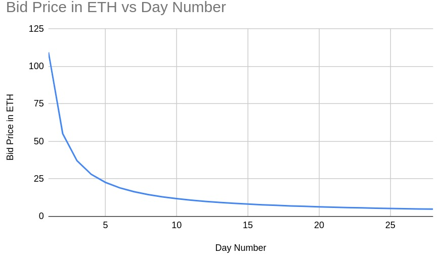

# Dutch Auction

## Introduction

### Summary
Stakers looking to become validators should be able to bid
for a position within a
[Dutch auction](https://en.wikipedia.org/wiki/Dutch_auction)
(an open-outcry descending price auction).
The price decreases based on the current number of validators
and the number of validators to be added.

### Context

AliceNet validators prove consensus by signing blocks under a distributed key.
The operation through which this distributed key is generated is called
the ETHDKG (Ethereum Distributed Key Generation) protocol or ceremony;
the resulting (public) key is the **group public key**
(the group secret key is never formed).

Because this key is distributed between all validators,
any change in validators will require the negotiation of a new group public key.
Thus, if a validator chooses to leave,
and it is desirable for the total validator count to remain the same,
a Dutch auction should be performed to fill the empty position
**before** an ETHDKG ceremony occurs.
Otherwise, two ETHDKG ceremonies would be required:

 *  One to negotiate a key after the validator exits
    (current validators except the one who left)
 *  One to generate a another key after another validator joins
    (current validators except the one who left plus the newly added)

The significant cost of running the ETHDKG protocol
(estimated at approximately 2.5M gas per validator)
necessitates care when executing it;
this protocol should only be performed when desired.
Thus, care will be taken whenever there is a change in the validator set
to ensure that the protocol is performed only when necessary,
as validators bear the cost of running ETHDKG.
In this way, there should be a cost associated when adding validators;
this is done by requiring all potential validators to bid for a position
via a [Dutch auction](https://en.wikipedia.org/wiki/Dutch_auction).

The decision to use a Dutch auction over the more familiar
[English auction](https://en.wikipedia.org/wiki/English_auction)
(an open-outcry ascending price auction)
comes from the advantage that the Dutch auction is over
after the first bid;
thus, it is not necessary to store the bids of potential validators.

### Goals
 *  Establish a mechanism to determine the price to become a validator.

### Non-Goals
 *  The mechanism to become a validator.
 *  The specifics of the ETHDKG protocol.

### Assumptions
Values defined at testing are a guide and may be modified in the future.

## Specification

### Overview
The solution consists of a Smart Contract that provides the following functionality:

#### Start an auction
This operation starts an auction by receiving the auction parameters, calculating final price
and registering the current block number as the auction's start block; upon execution, an event with all auction information will be emitted.
The execution of this operation will be triggered only by Alicenet (onlyFactory) whenever a new validator position is opened. 

Currently there is only support for starting one active auction at a time.
#### Get current bidding price
This operation calculates the current bidding price as determined by the price curve and the number of blocks since the start of the auction.
The execution of this operation may be performed at any time to check the current bid price.

#### Bid for current auction price
This operation emits an event with address of the winner and auction details.
The execution of this operation can be triggered at any time by any address that pays the current bid price to become a validator. 

### Data
These variables govern the price curve:

#### Auction parameters
The following values are set at auction starting to produce the results detailed in the [Testing](#testing) section; these values may be modified between auctions to adapt the price curve to specific requirements.

| Descriptor | Description | Default Value for testing purposes|
| ---------- | ----------- |-------------------------- |
| Start Price | The start price of the auction in Wei | 1000000.000000000000 |
| Decay | The decay factor (how fast bidding price decreases with time) | 16 |
| Scale Parameter | The scale factor (how much the price curve is compressed) | 10 |

#### Execution variables
The following values are calculated at execution time:

| Descriptor | Description | Calculated Value |
| ---------- | ----------- | ---------------- |
| Final Price  | The final price for auction in Wei (bidding price can never be less than this value) | Cost to add a validator * Current Number of Registered Validators|

Knowing that ETHDKG ceremony consumes approx 1.2M gas units for operation, total cost to add a single validator is calculated as follows:
* Single Validator ETHDKG cost = 1200000 * 2 operations (Destroy key and Generate key) * current gasPriceInWei

For dutch auction price curve to be functional start price must always be higher than final price so starting of an auction will revert if this condition is no met.


### Logic

#### Start Auction
This function will be called when a new validator position has opened; this may happen when a current validator leaves the network and is replaced or when the total number of validators of the network is increased.
##### Parameters
| Descriptor | Description | Default value for testing purposes |
| ---------- | ----------- |-------------------------- |
| Start Price  | The initial price for auction in Wei | 1000000 * 10 ** 18 |

The following actions are performed:

 *  Define auction start price with parameter value
 *  Calculate auction final price by multiplying ETHDKG Validator Cost by the number of current validators in network
 *  Determine the current auction id by increasing a counter.
 *  Define the auction's start block as the current block number.
 *  emit an AuctionStarted event with auction id, initial price, and final price.
 *  Activate the auction

##### Exceptions
Reverts if current active auction found
Reverts if calculated final price is higher than specified start price

##### Access Control 
This operation can only be performed by factory.

#### Get Bid Price
This function will be called when a bidder wants to know the current bid price.
The following actions are performed:

 *  Calculate the number of blocks between current block and auction's start block
    (time elapsed since start).
 *  Determine current auction price using the following function:

```solidity
function _dutchAuctionPrice(uint256 blocks) internal view returns (uint256 result) {
    uint256 _alfa = _startPrice - _finalPrice;
    uint256 t1 = _alfa * _scaleParameter;
    uint256 t2 = _decay * blocks + _scaleParameter ** 2;
    uint256 ratio = t1 / t2;
    return _finalPrice + ratio;
}
```
##### Access Control 
This operation is public.

##### Exceptions
Revert if no active auction found

#### Bid for Current Price
This function will be called when a bidder wants to bid the current price and earn the validator position.
The following actions are performed:

 *  Bidder includes appropriate ETH amount within transaction.
 *  Emit an event with address of the winner (sender) and auction details.
 *  Deactivate the current auction

##### Access Control 
This operation is public.

##### Exceptions
Revert if no active auction found

#### Stop Auction
This function will be called to finish current auction so new auction can be started.
The following actions are performed:

 * Deactivate Set activateAuction flag to true

##### Exceptions
Reverts if no current active auction found

##### Access Control 
This operation can only be performed by factory.


### Testing

The following tests were executed with the following parameters:
* Start price: 1000000
* Decay : 16
* Scale Parameter: 10

This is the expected initial bidding price in ETH (block 0):
1000000.0000000000000000000

These are the expected price values for the first 5 blocks of the started auction (in ETH):
| Block | Expected Price |
| ----------- | ----------- |
|1|100000.864000000000000000|
|2|86207.773793103448275862|
|3|75758.463030303030303030|
|4|67568.462702702702702702|
|5|60976.511219512195121951|

These are the expected price values for the first 28 days of the started auction (in ETH):
| Day | Expected Price |
| ----------- | ----------- |
| 1 | 109.349230435725124647 |
| 2 | 55.184001735169721288 |
| 3 | 37.115869549497432930 |
| 4 | 28.079353473992515051 |
| 5 | 22.656659579084400086 |
| 6 | 19.041203486059378729 |
| 7 | 16.458574749697777502 |
| 8 | 14.521515636442539803 |
| 9 | 13.014862212792632061 |
| 10 | 11.809506780948247802 |
| 11 | 10.823285266210324896 |
| 12 | 10.001419142510985334 |
| 13 | 9.305983408169056402 |
| 14 | 8.709887936512857076 |
| 15 | 8.193266112115732368 |
| 16 | 7.741217636607760432 |
| 17 | 7.342347940414342426 |
| 18 | 6.987794427901481633 |
| 19 | 6.670560206494055301 |
| 20 | 6.385047686214940595 |
| 21 | 6.126725429613631901 |
| 22 | 5.891885856324163304 |
| 23 | 5.677466152147864401 |
| 24 | 5.480913948841288642 |
| 25 | 5.300085239355930732 |
| 26 | 5.133165850116431438 |
| 27 | 4.978610363202353300 |
| 28 | 4.835094126126684698 |
| 29 | 4.701475190254196068 |

The following graph represents the price curve in ETH for the first month according to testing parameters



The contract should pass the following tests:

 - [x] Should obtain correct bid price at first auction block
 - [x] Should obtain correct bid prices through five blocks
       according to dutch auction curve
 - [x] Should restart the auction
 - [x] Should get correct prices for the first 30 days

### Presentation

N/A

### Security / Risks

* Being able to start an auction via manipulation of factory state
* Being able to get a Validator for an unexpected price
* Stopping mining blocks while waiting for Dutch Auction to finish 

## Further Considerations

### Timeline

Should be released on Q1/2023

### Prioritization

Low / Medium priority.

### Alternative Solutions

N/A

### Dependencies

None

### Open Questions

Get a better understanding of the appropriate decay rates
for Dutch auctions.