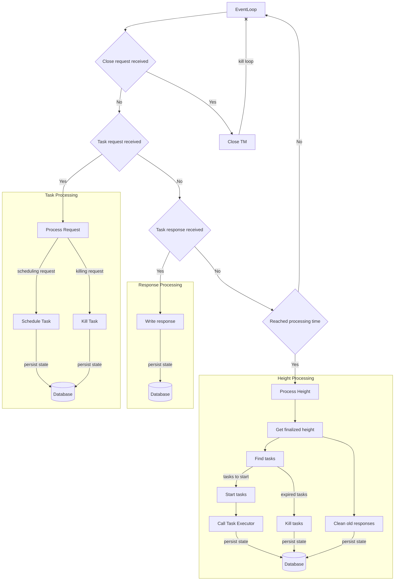
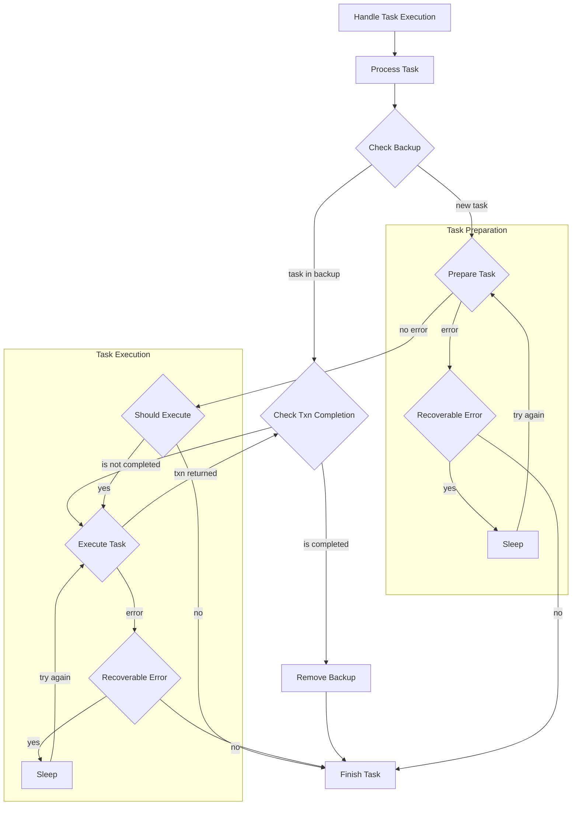

## Introduction

#### Summary   
This specification proposes a system to manage processes with a defined responsibility, called tasks.  

#### Context
As an AliceNet validator, I need a mechanism to manage tasks with a specific purpose. Its main responsibility is to: receive a request for a task, schedule it, initialize, start, execute and finish the execution of each task in a concurrent manner. This system should start within the validators startup and be recoverable after an eventual crash.

#### Goals
 - Establish a way to communicate with their clients. Receive a request with the task specifications and return a task response with its result. There must be 2 request types: for scheduling or for killing a task.
 - Each task must be stored to the Database and updated while executing with all the needed information in order to recover from any of its states.
 - Finished and Killed tasks must be pruned from the Database in order to avoid storage leaks.
 - The Tasks Manager must save the tasks in the scheduler and be able to start and expire them basing on the specified start and end blocks. If the start block is not specified, the task will start immediately. If the end block is not specified, the task won't expire, it will finish based on their own conditions. It must be able to kill the tasks if receives a killing request.
 - Each task must be able to communicate with Ethereum blockchain using Contracts interfaces and track the result of each interaction using the Transactions Watcher.
 - This system must have the ability to close all their processes and ongoing tasks in a cascade manner, preserving their state for the restart after recovering.
#### Non Goals
 - This mechanism won't be able to schedule any task automatically. It will be always waiting for a request from their clients.

#### Assumptions
 - For the Task Execution Mechanism to work, the validator must be connected with Ethereum chain.
 - The Transactions Watcher must be able to inform the transaction state in order to track the execution on chain.

## Specification

#### Overview
The Task Execution Mechanism must start after the connection with an Ethereum node is established and pass the Task Handler to all of its clients in order to be ready to receive requests.
This Mechanism is split in 3 main pieces:
 - Task Handler: it is the interface that communicates with the clients. It is able to receive a request and return a response structure, which will inform the result once the task finishes.
 - Task Manager: it is the intermediary between the Task Handler and the Task Executor. It's responsible for:
   1. Receiving a task scheduling request and save the task into the scheduler.
   2. Receiving a task/s killing request by ID or by Type and close the specified task/s.
   3. Receiving a response from the Task Executor and sending it to the Task Handler.
   4. Starting a task delegating its execution to the Task Executor.
   5. Expiring the tasks based on its expiration block and the current system block.
   6. Pruning finished tasks.
   7. Updating itself with the current system block.
 - Task Executor: it is the piece that takes care of the task state transitions. It's responsible for:
   1. Initializing the task.
   2. Executing the task based on the task requirements.
   3. Understanding if a task should be executed.
   4. Tracking the transaction generated by the task execution in order to understand its result.

#### Data
The main data structure is the BaseTask, it has all the necessary information for the processing:
 - ID: task id
 - Name: task name or type
 - AllowMultiExecution: a flag to allow/disallow parallel execution with other tasks of the same type/name
 - SubscribeOptions: 
   - EnableAutoRetry: flag to enable/disable auto retry of a transaction in case it becomes stale
   - MaxStaleBlocks: the amount of blocks we should consider a transaction stale and mark it for retry
 - Start: which block the task should be started. In case the start is 0 the task is started immediately.
 - End: Which block the task should be ended. In case the end is 0 the task runs forever (until the task succeeds, or it's killed)
 - isInitialized: flag that marks if the task was already initialized (this only should be done once)

#### Logic
<!--- APIs / Pseudocode / Flowcharts / Conditions / Limitations -->
API:
 - Task - every task must implement this interface:
    - `Lock()`: an implementation of Mutex Locker interface for locking
    - `Unlock()`: an implementation of Mutex Locker interface for unlocking
    - `Initialize()`: initializes the task. This implementation is shared by all the tasks. 
    - `Prepare()`: prepare the task before the execution. Each task has its own preparation logic. This logic could be empty if not necessary.
    - `Execute()`: execute the task. Each task has its own execution logic.
    - `ShouldExecute()`: the logic that determines if the task should be executed in any moment of the process.  Each task has its own logic for it.
    - `Finish()`: inform to the Task Manager the result of the execution. This implementation is shared by all the tasks.
    - `Kill()`: kills or stops the execution of a task. This implementation is shared by all the tasks.
    - `KillChan()`: returns a channel that is closed when the Task was killed. This implementation is shared by all the tasks.
    - `WasKilled()`: returns true if the task was killed. This implementation is shared by all the tasks.
    - `GetId()`: returns the Task ID. This implementation is shared by all the tasks. 
    - `GetStart()`: returns the Task Start block. This implementation is shared by all the tasks. 
    - `GetEnd()`: returns the Task End block. This implementation is shared by all the tasks. 
    - `GetName()`: returns the Task Name/Type. This implementation is shared by all the tasks.
    - `GetAllowMultiExecution()`: returns the Task AllowMultiExecution flag. This implementation is shared by all the tasks.
    - `GetSubscribeOptions()`: returns the Task SubscribeOptions. This implementation is shared by all the tasks.
    - `GetClient()`: returns the client that is used by the Task to communicate with the chain. This implementation is shared by all the tasks.
    - `GetContractsHandler()`: returns the interface that is used by the Task to execute the smart contracts. This implementation is shared by all the tasks.
    - `GetLogger()`: returns the Task logger. This implementation is shared by all the tasks.
 - Task Handler:
    - `ScheduleTask()`: receives the Task scheduling request and returns a handler which will inform the Task response.
    - `KillTaskByType()`: receives the Task killing request by type and returns a handler which will inform the Task response.
    - `KillTaskById()`: receives the Task killing request by ID and returns a handler which will inform the Task response.
    - `Start()`: starts the whole Task Execution Mechanism, including Task Handler, Manager and Executor.
    - `Close()`: closes the whole Task Execution Mechanism, including Task Handler, Manager and Executor.
    - `CloseChan()`: returns a channel that is closed when the Handler is shut down.
 - Task Response - returned to the client in order to inform the Task execution result:
   - `IsReady()`: informs if the result is ready, meaning the task finished. 
   - `GetResponseBlocking()`: blocks the execution until the task finishes. Then a response is returned.

Flowcharts:
 - Task Manager (TM):

 - Task Executor (TE):

#### Presentation
N/A

#### Testing
Reach 85% coverage in the principal pieces. Test every exit path. Test race conditions.

#### Security / Risks
N/A

## Further Considerations

#### Alternative Solutions
N/A

#### Timeline
N/A

#### Prioritization
N/A

#### Dependencies
N/A

#### Open Questions
N/A

